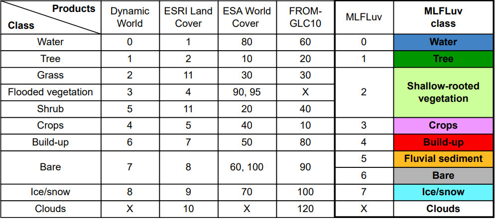

# MLFluv Dataset Creation README

This README provides instructions for creating the MLFluv dataset.

## 1. Get HydroSHEDS River Network for the Amazon Basin

To obtain the HydroSHEDS river network for the Amazon basin, follow these steps:

- Run the `getHydroshedsBasin.js` script on the Google Earth Engine code editor to create the Amazon river basin outline (referred to as buffer) from HydroBasin data.
- Download the Hydroshed river network data with river order 1-6 within the buffer from Google Drive to a local directory.
- Convert the downloaded river network shapefiles to TIFF format using QGIS. Here are the steps:
  - Open QGIS.
  - Go to Processing --> Toolbox --> Rasterize.
  - In the Rasterize (Vector to Raster) interface:
    - Input layer: Amazon_river_network.
    - Field to use for a burn-in value: RIV_ORD or UPLAND_SKM.
    - Output raster size unit: Pixels.
    - Width/Horizontal resolution: 10000.
    - Height/Vertical resolution: 10000.
    - Output extent --> Calculate from layer --> Amazon_river_network.
    - Assign a specific nodata value to output bands: -999.

## 2. Sample Points Along the River Network

Use the `random_sampler.py` script to create samples along the river network. Given a sample length n, n points are sampled, and the coordinates, river order, and upland drainage area information of each point are recorded in a CSV file called "network_da_order_n_sample.csv".

## 3. Download Training Data for Each Sampled Point

Run the `get_ee_data.py` script to download point data for points given in the CSV. Buffer each point to an Area of Interest and then download data, including Sentinel-1 & Sentinel-2 images, ESRI Land Cover map, ESA World Cover map, Dynamic World map, FROM-GLC10 map within the buffer. Remap all LULC maps to a uniform land cover scheme. Remapping rules are specified in `remapping_lulc_classes.png`.

## 4. Evaluate LULC Label

Run the `label_prepare.py` script to plot Sentinel-1 & Sentinel-2 pairs and four types of LULC (Land Use and Land Cover) maps. Load all data into a NumPy array and remove data points where Sentinel-1 or Sentinel-2 has NaN values. Evaluate which LULC map is better suited for labeling the fluvial scenes by reviewing the plots for each point. Filter through downloaded ESRI maps of all points and find the point where water pixels occur in the ESRI map. Create labels from these points.

## 5. Download Validating Planet Scene Data for Labeling

Run the `get_planet_data.py` script to download Planet tiles for each point from Step 4.

## 6. Create Hand Labels in QGIS

Use the Thrase plugin in QGIS to create hand labels.

## 7. Split Labelled Data into 5 Folds

Run the `split_data.py` script to create npy files for split labelled data paths. 

